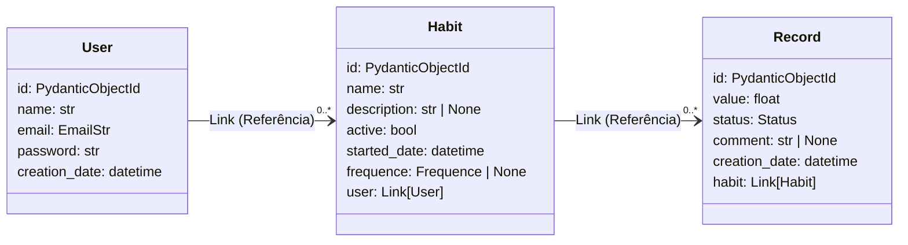

# Habit Tracker API (MongoDB)
RestAPI de sistema de rastreamento de hábitos desenvolvido
com FastAPI, MongoDB e Beanie.

### Tecnologias utilizadas:
- **Linguagem de programação:** Python 3.12
- **Framework Web:** FastAPI
- **Banco de Dados:** MongoDB
- **ODM (Object Document Mapper):** Beanie
- **Gerenciador de Dependências:** uv

### Diagrama de classes


## Executando o projeto
1. Clone o repositório:
```bash
git clone https://github.com/rgcastrof/HabitTracker && cd HabitTracker
```
2. Crie e inicie o ambiente virtual:
```bash
uv venv --python 3.12 && source .venv/bin/activate
```

3. Instale as dependências:
```bash
uv sync
```

4. Inicie o servidor:
```bash
uvicorn --reload main:app
```

O servidor pode ser acessado em: http://127.0.0.1:8000
