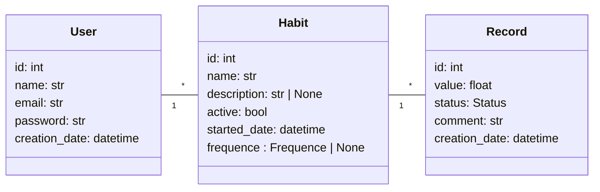

# Habit Tracker API

Rest API para sistema de rastreamento de hábitos.
O projeto atualmente contém três entidades, a saber:
- Usuário
- Hábito
- Registro

Com os seguintes relacionamentos:
- Um usuário pode ter 0 ou mais hábitos e um hábito está relacionado a somente um usuário
-  Um hábito pode ter 0 ou mais registros e um registro está relacionado a somente um hábito

### Diagrama de Classes


## Executando o projeto
1. Clone o repositório:
```bash
git clone https://github.com/rgcastrof/HabitTracker && cd HabitTracker
```
2. Instale as dependências:
```bash
uv sync
```
3. Rode as migrations:
```bash
alembic upgrade head
```

4. Inicie o servidor:
```bash
uvicorn --reload main:app
```

O servidor pode ser acessado em: http://127.0.0.1:8000
